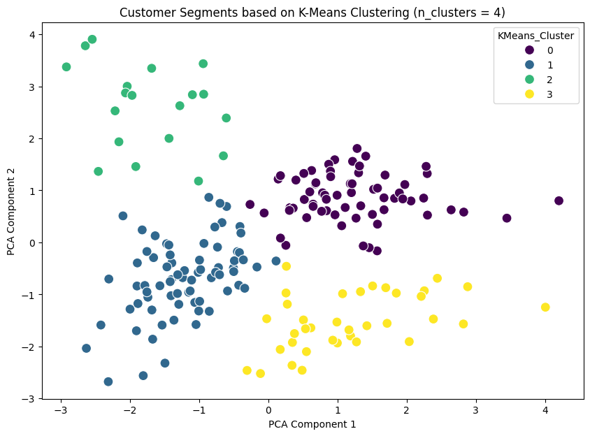
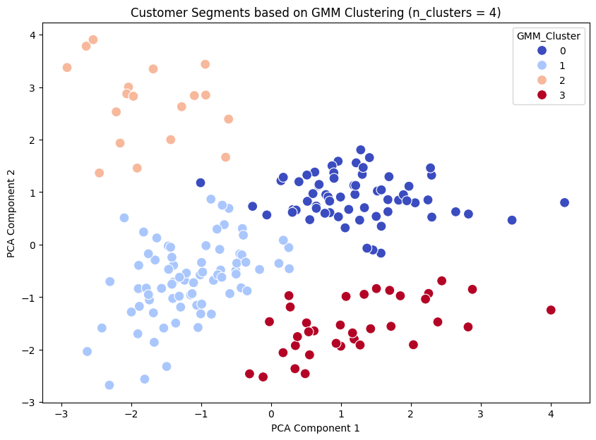

# Customer Segmentation Using K-Means, GMM, and DBSCAN Clustering (unsupervised ml model)

## Project Overview
This project aims to segment customers from a mall dataset into different groups based on their purchasing behavior using three different clustering techniques: **K-Means**, **Gaussian Mixture Model (GMM)**, and **DBSCAN**. The goal is to better understand customer patterns and behaviors to inform business strategies such as personalized marketing.

### Key Steps:
1. **Data Loading & Preprocessing**
   - The dataset `Mall_Customers.csv` is loaded and preprocessed. Key preprocessing steps include handling missing values, encoding categorical variables, and feature scaling.
2. **Feature Engineering**
   - New features such as **Income Per Age** and **Spending Income Ratio** were created to improve the clustering results.
3. **Outlier Detection & Removal**
   - Outliers were identified using the Z-score method and removed for cleaner clustering results.
4. **Dimensionality Reduction**
   - PCA (Principal Component Analysis) was applied to reduce the data to 2 components for better visualization and clustering efficiency.
5. **Clustering Algorithms**
   - **K-Means** and **GMM** clustering were used to segment customers, followed by an evaluation using the **Silhouette Score**. Additionally, **DBSCAN** was employed for density-based clustering.
6. **Visualization**
   - The results were visualized to depict customer clusters and their separation in a 2D space using PCA components.

---

## Feature Engineering

To improve the clustering results, two new features were engineered based on the existing dataset:

1. **Income Per Age**:
   - Formula: `Annual Income (k$) / (Age + 1)`
   - This feature provides insight into how much income a customer generates relative to their age, smoothing out younger customers with low incomes.

2. **Spending Income Ratio**:
   - Formula: `Spending Score / Annual Income (k$)`
   - This ratio helps to identify how much customers spend compared to their income, distinguishing high spenders from low spenders relative to their earnings.

These engineered features aim to capture customer behaviors beyond the basic demographic and spending information, improving clustering performance.

---

## Clustering Methods

Three different clustering algorithms were used and evaluated: **K-Means**, **Gaussian Mixture Model (GMM)**, and **DBSCAN**. Below are the key steps and results for each method.

### 1. K-Means Clustering
- **Description**: K-Means groups data points into clusters by minimizing the within-cluster variance.
- **Hyperparameters**:
  - Number of clusters: 4 (chosen based on the elbow method)
  - `n_init = 50`, `max_iter = 500`, `random_state = 42`
- **Silhouette Score**: `0.515`
  
  K-Means achieved the highest silhouette score, indicating well-separated customer segments.

### 2. Gaussian Mixture Model (GMM)
- **Description**: GMM is a probabilistic clustering model that assumes data points are generated from a mixture of several Gaussian distributions.
- **Hyperparameters**:
  - Number of components (clusters): 4
  - `random_state = 42`
- **Silhouette Score**: `0.512`
  
  GMM performed similarly to K-Means, but the clusters were less clearly defined in comparison.

### 3. DBSCAN (Density-Based Spatial Clustering of Applications with Noise)
- **Description**: DBSCAN identifies clusters based on density, making it suitable for discovering arbitrarily shaped clusters and outliers.
- **Hyperparameters**:
  - `eps = 0.3`, `min_samples = 5`
- **Silhouette Score**: Not computed (DBSCAN failed to form sufficient clusters for evaluation)
  
  DBSCAN struggled with this dataset, resulting in many noise points and insufficient cluster formation for a silhouette score evaluation.

---

## Results

### K-Means Clustering
- K-Means was the best-performing clustering method with a **Silhouette Score of 0.515**.
- The customer groups were well-defined, and the clusters were visually distinct when plotted using PCA components.
  
### Gaussian Mixture Model (GMM)
- GMM provided results similar to K-Means with a **Silhouette Score of 0.512**, but the clusters were softer, reflecting the probabilistic nature of the model.
  
### DBSCAN Clustering
- DBSCAN was not as effective for this dataset. Many points were classified as noise, and insufficient clusters were formed to calculate a silhouette score.

---

### Visualizations

1. **K-Means Clustering (n_clusters = 4)**:
   
   

2. **GMM Clustering (n_clusters = 4)**:
   
   

3. **DBSCAN Clustering (Ignoring Noise)**:
   
   

